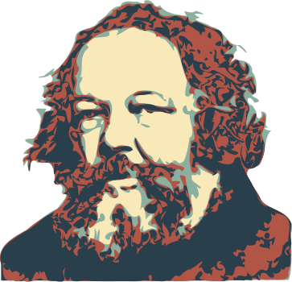
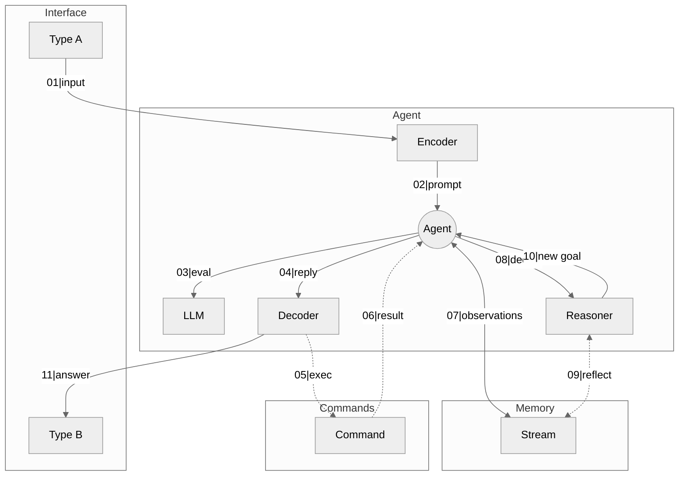

<p align="center">
  
  <h3 align="center">thinker</h3>
  <p align="center"><strong>LLM generative agents for Golang</strong></p>

  <p align="center">
    <!-- Version -->
    <a href="https://github.com/kshard/thinker/releases">
      
    </a>
    <!-- Documentation -->
    <a href="https://pkg.go.dev/github.com/kshard/thinker">
      
    </a>
    <!-- Build Status  -->
    <a href="https://github.com/kshard/thinker/actions/">
      
    </a>
    <!-- GitHub -->
    <a href="https://github.com/kshard/thinker">
      
    </a>
    <!-- Coverage -->
    <a href="https://coveralls.io/github/kshard/thinker?branch=main">
      
    </a>
    <!-- Go Card -->
    <a href="https://goreportcard.com/report/github.com/kshard/thinker">
      
    </a>
  </p>
</p>

---

The library enables development of LLM-based generative agents for Golang. 

## Inspiration

The generative agents autonomously generate output as a reaction on input, past expereince and current environment. Agents records obervations and reason over with natural language description, taking advantage of LLMs.

* [Generative Agents: Interactive Simulacra of Human Behavior](https://arxiv.org/pdf/2304.03442)
* [LLM Reasoner and Automated Planner: A new NPC approach](https://arxiv.org/pdf/2501.10106)

In this library, an agent is defined as a side-effect function `ƒ: A ⟼ B`, which takes a Golang type `A` as input and autonomously produces an output `B`, while retaining memory of past experiences.

- [Inspiration](#inspiration)
- [Getting started](#getting-started)
- [Quick example](#quick-example)
- [Agent Architecture](#agent-architecture)
  - [Commands \& Tools](#commands--tools)
  - [Chaining agents](#chaining-agents)
- [How To Contribute](#how-to-contribute)
  - [commit message](#commit-message)
  - [bugs](#bugs)
- [License](#license)


## Getting started

The latest version of the library is available at `main` branch of this repository. All development, including new features and bug fixes, take place on the `main` branch using forking and pull requests as described in contribution guidelines. The stable version is available via Golang modules.

Running the examples you need access either to AWS Bedrock or OpenAI.  

## Quick example

See ["Hello World"](./examples/helloworld/hw.go) application as the quick start. The example agent is `ƒ: string ⟼ string` that takes the sentence and returns the anagram.

```go
package main

import (
  "context"
  "fmt"

  // LLMs toolkit
  "github.com/kshard/chatter"
  "github.com/kshard/chatter/bedrock"

  // Agents toolkit
  "github.com/kshard/thinker/agent"
  "github.com/kshard/thinker/codec"
  "github.com/kshard/thinker/memory"
  "github.com/kshard/thinker/reasoner"
)

// This function is core in the example. It takes input (the sentence)
// and generate prompt function that guides LLMs on how to create anagram.
func anagram(expr string) (prompt chatter.Prompt, err error) {
  prompt.
    WithTask("Create anagram using the phrase: %s", expr).
    With(
      // instruct LLM about anagram generation
      chatter.Rules(
        "Strictly adhere to the following requirements when generating a response.",
        "The output must be the resulting anagram only.",
      ),
    ).
    With(
      // Gives the example of input and expected output
      chatter.Example{
        Input: "Madam Curie",
        Reply: "Radium came",
      },
    )

  return
}

func main() {
  // create instance of LLM client
  llm, err := bedrock.New(
    bedrock.WithLLM(bedrock.LLAMA3_1_70B_INSTRUCT),
    bedrock.WithRegion("us-west-2"),
  )
  if err != nil {
    panic(err)
  }

  // We create an agent that takes string (sentence) and returns string (anagram).
  agt := agent.NewAutomata(llm,
    // Configures memory for the agent. Typically, memory retains all of
    // the agent's observations. Here, we use a void memory, meaning no
    // observations are retained.
    memory.NewVoid(),

    // Configures the reasoner, which determines the agent's next actions and prompts.
    // Here, we use a void reasoner, meaning no reasoning is performed—the agent
    // simply returns the result.
    reasoner.NewVoid[string, string](),

    // Configures the encoder to transform input of type A into a `chatter.Prompt`.
    // Here, we use an encoder that converts string expressions into prompt.
    codec.FromEncoder(anagram),

    // Configure the decoder to transform output of LLM into type B.
    // Here, we use the identity decoder that returns LLMs output as-is.
    codec.DecoderID,
  )

  // Evaluate expression and receive the result
  val, err := agt.Prompt(context.Background(), "a gentleman seating on horse")
  fmt.Printf("==> %v\n%+v\n", err, val)
}
```

## Agent Architecture

The `thinker` library provides toolkit for running agents with type-safe constraints. It is built on a pluggable architecture, allowing applications to define custom workflows. The diagram below emphasis core building blocks.



[`Memory`](./memory.go) is core element of agents behaviour. It is a database that maintains a comprehensive record of an agent’s experience. It recalls observations and builds the context windows to be used for prompting.

[`Reasoner`](./reasoner.go) serves as the goal-setting component in the architecture. It evaluates the agent's current state, performing either deterministic or non-deterministic analysis of immediate results and past experiences. Based on this assessment, it determines whether the goal has been achieved and, if not, suggests the best new goal for the agent to pursue.

The type-safe agent interface `ƒ: A ⟼ B` is well-suited for composition and agent chaining. However, encoding and decoding application-specific types must be abstracted. To facilitate this, the library provides two key traits: [`Encoder`](./codec.go) for constructing prompts and [`Decoder`](./codec.go) for parsing and validating LLM responses.

The [rainbow example](./examples/rainbow/rainbow.go) demonstrates a simple agent that effectively utilizes the depicted agent architecture to solve a task.

### Commands & Tools

The `thinker` library enables the integration of external [tools and commands](./command.go) into the agent workflow. By design, a command is a function `Decoder[CmdOut]` that takes input from the LLM, executes it, validates and returns the output and any possible feedback - similary as you implement basic decoder.

When constructing a prompt, it is essential to include a section that "advertises" the available commands and the rules for using them. There is [a registry](./command/registry.go) that automates prompting and parsing of the response.

The [script example](./examples/script/script.go) demonstrates a simple agent that utilizes `bash` to generate and modify files on the local filesystem.


### Chaining agents

The `thinker` library does not provide built-in mechanisms for chaining agents. Instead, it encourages the use of standard Go techniques either pure functional chaining or chaining of go routines (e.g. [golem/pipe](https://github.com/fogfish/golem)). 

The [chain example](./examples/chain/chain.go) demostrates off-the-shelf techniques for agents chaining.


## How To Contribute

The library is [MIT](LICENSE) licensed and accepts contributions via GitHub pull requests:

1. Fork it
2. Create your feature branch (`git checkout -b my-new-feature`)
3. Commit your changes (`git commit -am 'Added some feature'`)
4. Push to the branch (`git push origin my-new-feature`)
5. Create new Pull Request

The build and testing process requires [Go](https://golang.org) version 1.21 or later.

**build** and **test** library.

```bash
git clone https://github.com/kshard/thinker
cd thinker
go test ./...
```

### commit message

The commit message helps us to write a good release note, speed-up review process. The message should address two question what changed and why. The project follows the template defined by chapter [Contributing to a Project](http://git-scm.com/book/ch5-2.html) of Git book.

### bugs

If you experience any issues with the library, please let us know via [GitHub issues](https://github.com/kshard/chatter/issue). We appreciate detailed and accurate reports that help us to identity and replicate the issue. 


## License

[](LICENSE)

