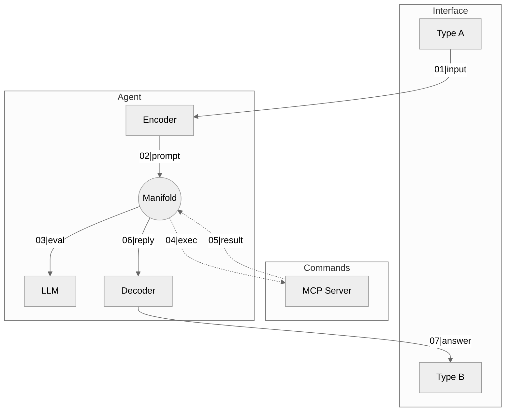
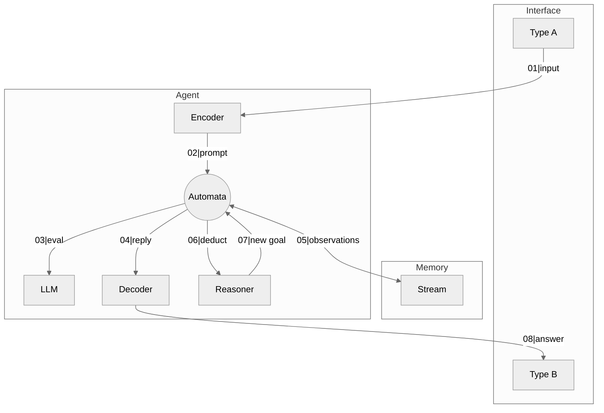

<p align="center">
  
  <h3 align="center">thinker</h3>
  <p align="center"><strong>LLM generative agents for Golang</strong></p>

  <p align="center">
    <!-- Version -->
    <a href="https://github.com/kshard/thinker/releases">
      
    </a>
    <!-- Documentation -->
    <a href="https://pkg.go.dev/github.com/kshard/thinker">
      
    </a>
    <!-- Build Status  -->
    <a href="https://github.com/kshard/thinker/actions/">
      
    </a>
    <!-- GitHub -->
    <a href="https://github.com/kshard/thinker">
      
    </a>
    <!-- Coverage -->
    <a href="https://coveralls.io/github/kshard/thinker?branch=main">
      
    </a>
    <!-- Go Card -->
    <a href="https://goreportcard.com/report/github.com/kshard/thinker">
      
    </a>
  </p>
</p>

---

`thinker` is a Go library for building LLM-based generative agents. It provides type-safe, composable building blocks — from a single prompt call up to a full autonomous agent with memory, reasoning, and tool use — all sharing the same `ƒ: A ⟼ B` agent model.

## Overview

- [Overview](#overview)
- [Design](#design)
- [Quick start](#quick-start)
- [Core abstractions](#core-abstractions)
  - [Agent interface](#agent-interface)
  - [Encoder and Decoder](#encoder-and-decoder)
  - [Memory](#memory)
  - [Reasoner](#reasoner)
  - [Registry — MCP tools](#registry--mcp-tools)
- [Agentic toolkit](#agentic-toolkit)
  - [Prompter](#prompter)
  - [Manifold](#manifold)
  - [Automata](#automata)
- [Agent development with nanobot](#agent-development-with-nanobot)
  - [Runtime](#runtime)
  - [ReAct](#react)
  - [Seq](#seq)
  - [ThinkReAct](#thinkreact)
  - [Reflect](#reflect)
  - [Jsonify](#jsonify)
- [Agent composition](#agent-composition)
- [FAQ](#faq)
- [Contributing](#contributing)
- [License](#license)

## Design

The library is guided by four principles:

1. **Minimal** — no hidden magic; every component is explicit and replaceable.
2. **Typed** — inputs and outputs are Go generics (`A`, `B`); the compiler enforces correctness.
3. **Composable** — agents are functions; they can be piped, sequenced, or wrapped freely.
4. **Interoperable** — works with any LLM provider (AWS Bedrock, OpenAI, LM Studio, …) via the [`chatter`](https://github.com/kshard/chatter) adapter, and with any tool via the [Model Context Protocol](https://modelcontextprotocol.io).

An agent is a side-effect function `ƒ: A ⟼ B`. It accepts a typed input, optionally uses memory and external tools, and returns a typed output. This same signature is preserved at every level of the hierarchy, so simple prompt wrappers and full autonomous runtimes are interchangeable.

**References**
- [Generative Agents: Interactive Simulacra of Human Behavior](https://arxiv.org/pdf/2304.03442)
- [REACT : SYNERGIZING REASONING AND ACTING IN LANGUAGE MODELS](https://arxiv.org/pdf/2210.03629)

## Quick start

**Prerequisites:** Go 1.21+. Access to AWS Bedrock, OpenAI, or LM Studio. See [doc/HOWTO.md](./doc/HOWTO.md) for provider configuration.

```bash
go get github.com/kshard/thinker
```

The ["Hello World" example](./examples/01_helloworld/helloworld.go) creates `ƒ: string ⟼ *chatter.Reply` — an agent that produces anagrams:

```go
package main

import (
  "context"
  "fmt"

  "github.com/kshard/chatter"
  "github.com/kshard/chatter/provider/autoconfig"
  "github.com/kshard/thinker/agent"
)

func anagram(expr string) (chatter.Message, error) {
  var prompt chatter.Prompt
  prompt.WithTask("Create anagram using the phrase: %s", expr)
  prompt.WithRules(
    "Strictly adhere to the following requirements when generating a response.",
    "The output must be the resulting anagram only.",
  )
  prompt.WithExample("Madam Curie", "Radium came")
  return &prompt, nil
}

func main() {
  llm, err := autoconfig.New("thinker")
  if err != nil { panic(err) }

  agt := agent.NewPrompter(llm, anagram)

  val, err := agt.Prompt(context.Background(), "a gentleman seating on horse")
  fmt.Printf("==> %v\n%+v\n", err, val)
}
```

More examples: [examples/](./examples/).

## Core abstractions

The root package `github.com/kshard/thinker` defines the interfaces that all components depend on. Higher-level packages (`agent`, `agent/nanobot`) assemble agents from these interfaces; lower-level packages (`memory`, `reasoner`, `codec`, `command`) supply ready-made implementations.

### Agent interface

Every agent — regardless of capability level — exposes a single method:

```go
Prompt(ctx context.Context, input A, opt ...chatter.Opt) (B, error)
```

The three concrete agent types differ only in which supporting components they assemble:

| Type       | Memory             | Reasoning           | Tool use | Best for                        |
| ---------- | ------------------ | ------------------- | -------- | ------------------------------- |
| `Prompter` | none (stateless)   | none                | no       | One-shot prompt → raw LLM reply |
| `Manifold` | ephemeral per call | delegated to LLM    | yes      | Structured I/O with tool loops  |
| `Automata` | durable stream     | application-defined | yes      | Multi-step autonomous loops     |

### Encoder and Decoder

`Encoder[A]` converts a Go value of type `A` into an LLM prompt (`chatter.Message`).  
`Decoder[B]` converts the LLM reply into a typed value `B`, returning a confidence score in `[0, 1]` and optional feedback for the LLM.

```go
type Encoder[T any] interface {
    Encode(T) (chatter.Message, error)
}

type Decoder[T any] interface {
    // Returns (confidence, result, error).
    // Return thinker.Feedback(...) as the error to send corrective feedback to the LLM.
    Decode(*chatter.Reply) (float64, T, error)
}
```

The [`codec`](./codec/) package supplies ready-made implementations:

| Symbol                 | Purpose                                                            |
| ---------------------- | ------------------------------------------------------------------ |
| `codec.EncoderID`      | Wraps a `string` as a prompt task                                  |
| `codec.DecoderID`      | Returns the raw `*chatter.Reply` unchanged                         |
| `codec.String`         | Encodes `string` → prompt; decodes reply → plain `string`          |
| `codec.FromEncoder(f)` | Lifts `func(A) (chatter.Message, error)` into `Encoder[A]`         |
| `codec.FromDecoder(f)` | Lifts `func(*chatter.Reply) (float64, B, error)` into `Decoder[B]` |

Use `thinker.Feedback(note, details...)` inside a decoder to send structured corrective feedback back to the LLM. The `Automata` loop routes the feedback to the `Reasoner` for the next `AGENT_REFINE` or `AGENT_RETRY` phase.

### Memory

`Memory` records agent observations and constructs the context window delivered to the LLM on each call.

```go
type Memory interface {
    Purge()                                           // discard all state
    Commit(*Observation)                              // record an observation
    Context(chatter.Message) []chatter.Message        // build context window
}
```

Built-in implementations in the [`memory`](./memory/) package:

| Type                             | Behaviour                                                                       |
| -------------------------------- | ------------------------------------------------------------------------------- |
| `memory.NewVoid(stratum)`        | Discards all observations; sends only the system prompt and the current message |
| `memory.NewStream(cap, stratum)` | Retains observations in chronological order; pass `memory.INFINITE` to keep all |

`stratum` is the system instruction string prepended to every context window (e.g. `"You are an autonomous agent…"`).

### Reasoner

`Reasoner[B]` is the goal-setting component. After each LLM call it inspects the agent's `State[B]` and returns the next execution phase:

```go
type Reasoner[B any] interface {
    Purge()
    Deduct(State[B]) (Phase, chatter.Message, error)
}
```

`State[B]` carries the decoded reply, confidence score, epoch counter, and any feedback from the decoder.

| Phase          | Meaning                                                 |
| -------------- | ------------------------------------------------------- |
| `AGENT_ASK`    | Issue a new prompt (new sub-goal)                       |
| `AGENT_RETURN` | Accept the current reply and return it to the caller    |
| `AGENT_RETRY`  | Retry the last prompt without updating memory           |
| `AGENT_REFINE` | Resend with a refined prompt that includes LLM feedback |
| `AGENT_ABORT`  | Halt with an unrecoverable error                        |

Built-in implementations in the [`reasoner`](./reasoner/) package:

| Type                            | Behaviour                                         |
| ------------------------------- | ------------------------------------------------- |
| `reasoner.NewVoid[B]()`         | Always returns `AGENT_RETURN`; one-shot behaviour |
| `reasoner.From(f)`              | Lifts any function into `Reasoner[B]`             |
| `reasoner.NewEpoch(max, inner)` | Decorator that aborts after `max` iterations      |

### Registry — MCP tools

`Registry` wraps one or more [Model Context Protocol](https://modelcontextprotocol.io) servers and exposes their tools to the agent loop.

```go
type Registry interface {
    Context() chatter.Registry                              // tool schema injected into the LLM prompt
    Invoke(*chatter.Reply) (Phase, chatter.Message, error)  // dispatch a tool call
}
```

The [`command`](./command/) package provides `*command.Registry`:

```go
registry := command.NewRegistry()
registry.ConnectCmd("fs",  []string{"my-mcp-server", "--flag"})  // stdio transport
registry.ConnectUrl("web", "https://mcp.example.com/sse")        // SSE transport
registry.Attach("local", myServerSession)                        // pre-connected session
```

Tool names are namespaced with the server ID using `_` as separator (e.g. `fs_read`) to satisfy provider constraints such as AWS Bedrock's `[a-zA-Z0-9_-]` requirement.

## Agentic toolkit

The [`agent`](./agent/) package assembles the core interfaces into three ready-to-use agent types.

### Prompter

`Prompter[A]` is the simplest agent: stateless, memoryless, one prompt → raw LLM reply. Internally it wires `Automata` with `memory.Void` and `reasoner.Void`.

```go
agt := agent.NewPrompter(llm, func(input MyInput) (chatter.Message, error) {
    var p chatter.Prompt
    p.WithTask("Summarize: %v", input)
    return &p, nil
})

reply, err := agt.Prompt(ctx, myValue)
// reply is *chatter.Reply
```

### Manifold

`Manifold[A, B]` runs a tool-use loop driven entirely by the LLM. On each iteration the LLM either returns a final reply or issues a tool-call; the registry executes the tool and feeds the result back. Output is decoded into type `B` by the provided `Decoder`.

```go
registry := command.NewRegistry()
registry.Attach("os", mcpSession)

agt := agent.NewManifold(
    llm,
    codec.FromEncoder(myEncoder),
    codec.String,   // decoder produces string
    registry,
)

result, err := agt.Prompt(ctx, "run the workflow")
```

`Manifold` requires a model with reliable tool-use support. See [AWS Bedrock supported models](https://docs.aws.amazon.com/bedrock/latest/userguide/conversation-inference-supported-models-features.html).


```mermaid
%%{init: {'theme':'neutral'}}%%
graph TD
    subgraph Interface
    A[Type A]
    B[Type B]
    end
    subgraph Commands
    C[MCP Server]
    end
    subgraph Agent
    A --"01|input"--> E[Encoder]
    E --"02|prompt"--> G((Manifold))
    G --"03|eval"--> L[LLM]
    G -."04|exec".-> C
    C -."05|result".-> G
    G --"06|reply"--> D[Decoder]
    D --"07|answer"--> B
    end
```

### Automata

`Automata[A, B]` is the full agent runtime. Memory, reasoning, and tool use are all under application control.

```go
agt := agent.NewAutomata(
    llm,
    memory.NewStream(memory.INFINITE, "You are an autonomous agent."),
    codec.FromEncoder(myEncoder),
    codec.FromDecoder(myDecoder),
    reasoner.NewEpoch(5, reasoner.From(myDeductFn)),
)
```

The main loop:
1. Encode input → build context window from memory → call LLM.
2. Decode the reply (may produce structured feedback).
3. Commit the observation to memory.
4. Call `Reasoner.Deduct` → get next phase.
5. Repeat or return.


```mermaid
%%{init: {'theme':'neutral'}}%%
graph TD
    subgraph Interface
    A[Type A]
    B[Type B]
    end
    subgraph Memory
    S[Stream]
    end
    subgraph Agent
    A --"01|input"--> E[Encoder]
    E --"02|prompt"--> G((Automata))
    G --"03|eval"--> L[LLM]
    G --"04|reply"--> D[Decoder]
    G <--"05|observations"--> S
    G --"06|deduct"--> R[Reasoner]
    R --"07|new goal"--> G
    D --"08|answer"--> B
    end
```

Call `agt.PromptOnce(ctx, input)` to purge memory and reasoner state before each invocation (isolated sessions).

## Agent development with nanobot

The [`agent/nanobot`](./agent/nanobot/) package provides a higher-level workflow toolkit built on top of `Automata` and `Manifold`. It introduces file-based prompt templates and five composable multi-bot patterns.

### Runtime

`Runtime` is the shared execution environment threaded through every nanobot constructor. It bundles:
- `FileSystem` — `fs.FS` root for prompt template files
- `LLMs` — registry of named `chatter.Chatter` instances (`Model(name) (chatter.Chatter, bool)`)
- `Registry` — optional `*command.Registry` for tool dispatch
- `Chalk` — optional progress-reporting sink (terminal, log, no-op default)

```go
rt := nanobot.NewRuntime(os.DirFS("prompts"), llms)
rt = rt.WithRegistry(registry)  // attach MCP tools
rt = rt.WithStdout(chalk)       // attach progress reporter
```

Use `"base"` as the canonical fallback model name in `LLMs`. Every nanobot constructor falls back to `"base"` when no model-specific entry is found.

### ReAct

`ReAct[A, B]` loads a Markdown prompt template from the runtime's file system and drives a `Manifold` tool-use loop. The YAML front-matter in the prompt file controls the model, retry budget, output format, and which MCP servers to connect.

```go
bot, err := nanobot.NewReAct[MyInput, MyOutput](rt, "classify.md")
// or panic variant:
bot := nanobot.MustReAct[MyInput, MyOutput](rt, "classify.md")

result, err := bot.Prompt(ctx, input)
```

Prompt file format (Markdown with YAML front-matter):

```markdown
---
name: Classify document
runs-on: base
retry: 3
servers:
  - type: url
    name: search
    url: https://mcp.example.com/sse
  - type: cmd
    name: fs
    command: [my-mcp-server, --flag]
schema:
  reply:
    type: object
    properties:
      category: { type: string }
---
Classify the following document into one of the categories: {{.Categories}}.

Document:
{{.Text}}
```

If `B` implements `encoding.TextUnmarshaler`, the decoder automatically parses JSON from the LLM reply into `B`.

### Seq

`Seq[S, A, B]` pipelines two bots over a shared blackboard state `S`. Bot `a` runs first; its output `A` is merged into `S` via an `apply` function; an optional `effect` runs; then bot `b` receives the updated `S`.

```
Seq : (S → A) ∘ apply(S, A → S) ∘ effect(S) ∘ (S → B)
```

```go
seq := nanobot.MustSeq(rt, botA, botB)
// optional: override the default lens-based merge
seq = seq.WithApply(func(s State, a StepResult) State { s.Step = a; return s })
// optional: side-effect between steps
seq = seq.WithEffect(func(ctx context.Context, s State) (State, error) {
    return s, nil
})

result, err := seq.Prompt(ctx, initialState)
```

The default `apply` uses a type-derived lens: when `S` has exactly one field of type `A`, the lens is resolved automatically.

### ThinkReAct

`ThinkReAct[S, A, B]` separates planning from execution. A `think` bot produces a task list `[]A`; a `react` bot executes each task independently, receiving the state `S` updated with the current task.

```
ThinkReAct : (S → []A) ∘ apply(S, A → S) ∘ effect(S) ∘ (S → B) for each A
```

```go
pte := nanobot.MustThinkReAct(rt, plannerBot, executorBot)
pte = pte.WithApply(func(s State, task Task) State { s.Current = task; return s })

results, err := pte.Prompt(ctx, initialState)
// returns []B — one result per planned task
```

Progress is reported to `Runtime.Chalk` for each task.

### Reflect

`Reflect[S, A, B]` implements a judge-then-correct loop. A `judge` bot evaluates the current state; the `accept` function decides whether to accept the verdict. On rejection, a `react` bot corrects the state, and the loop retries up to `attempts` times.

```
Reflect : judge(S → A) ∘ accept(S, A → S, int) ∘ [react(S → B) ∘ apply(S, B → S) ∘ effect(S)]*
```

`accept` returns `(S, positive int)` to accept; `(S, negative int)` to reject with feedback embedded in the returned `S`.

```go
loop := nanobot.MustReflect(rt, judgeBot, correctorBot)
loop = loop.WithAccept(func(s State, v Verdict) (State, int) {
    if v.OK { return s, 1 }
    s.Feedback = v.Reason
    return s, -1
})
loop = loop.WithAttempts(3)

result, err := loop.Prompt(ctx, state)
```

### Jsonify

`Jsonify[A]` is a specialised `Automata`-backed bot that forces LLM output to be a valid JSON array of strings, with automatic retry and application-defined validation.

```go
bot := nanobot.NewJsonify(
    llm,
    4, // max attempts
    codec.FromEncoder(myEncoder),
    func(seq []string) error {
        if len(seq) == 0 { return errors.New("empty list") }
        return nil
    },
)

items, err := bot.Prompt(ctx, input)
// items is []string
```

See the [rainbow example](./examples/02_rainbow/rainbow.go) for a `Jsonify` agent that uses feedback to guide the LLM toward the correct answer across multiple attempts.

## Agent composition

Every agent satisfies `Bot[S, A]` — `Prompt(ctx, S) (A, error)`. Compose with plain Go:

```go
// Sequential pipeline
result1, err := agentA.Prompt(ctx, input)
if err != nil { return err }
result2, err := agentB.Prompt(ctx, result1)

// Fan-out
var wg sync.WaitGroup
for _, item := range tasks {
    wg.Add(1)
    go func(item Task) {
        defer wg.Done()
        worker.Prompt(ctx, item)
    }(item)
}
wg.Wait()
```

For shared state across encoder, decoder, and reasoner, use a struct with receiver methods:

```go
type MyAgent struct {
    SharedData string
    *agent.Automata[string, string]
}

func (a *MyAgent) Encode(input string) (chatter.Message, error)       { /* use a.SharedData */ }
func (a *MyAgent) Decode(reply *chatter.Reply) (float64, string, error) { /* ... */ }
func (a *MyAgent) Deduct(s thinker.State[string]) (thinker.Phase, chatter.Message, error) { /* ... */ }
```

**Examples:**
- [Chain](./examples/05_chain/chain.go) — sequential two-agent pipeline
- [Text processor](./examples/06_text_processor/processor.go) — chaining with file I/O
- [AWS Step Functions](./examples/07_aws_sfs/main.go) — distributed chaining

## FAQ

<details>
<summary>Do agents support concurrent execution?</summary>

A single agent instance is sequential by design. The inner loop requires each step to depend on the previous LLM reply to maintain causal coherence. `memory.Stream` is thread-safe and can be shared across a pipeline, but is not designed for multiple isolated sessions within one instance.

To run tasks concurrently, create one agent instance per goroutine, or build a worker pool over a shared pool of LLM clients.
</details>

<details>
<summary>How to deploy agents to AWS?</summary>

AWS Step Functions is the recommended approach for chaining agents in a serverless setting — it handles retries, state persistence, and fan-out natively. Consider the [typestep library](https://github.com/fogfish/typestep) for a type-safe Go DSL for Step Functions.

See the [AWS Step Functions example](./examples/07_aws_sfs/main.go) for a working pattern.
</details>

<details>
<summary>Which LLM providers are supported?</summary>

Any provider that implements `chatter.Chatter`. Built-in adapters in [`chatter`](https://github.com/kshard/chatter): AWS Bedrock (Converse API), OpenAI-compatible endpoints (OpenAI, LM Studio, and compatible local servers). See [doc/HOWTO.md](./doc/HOWTO.md) for configuration.

Tool use (`Manifold`, `ReAct`) requires a model with reliable function-calling support.
</details>

## Contributing

The library is [MIT](LICENSE) licensed and accepts contributions via GitHub pull requests:

1. Fork it
2. Create your feature branch (`git checkout -b my-new-feature`)
3. Commit your changes (`git commit -am 'Added some feature'`)
4. Push to the branch (`git push origin my-new-feature`)
5. Create new Pull Request

**Build and test:**

```bash
git clone https://github.com/kshard/thinker
cd thinker
go test ./...
```

Commit messages should answer _what_ changed and _why_, following the [Contributing to a Project](http://git-scm.com/book/ch5-2.html) template from the Git book.

Report bugs via [GitHub issues](https://github.com/kshard/thinker/issues) with a reproducible test case.

## License

[](LICENSE)
