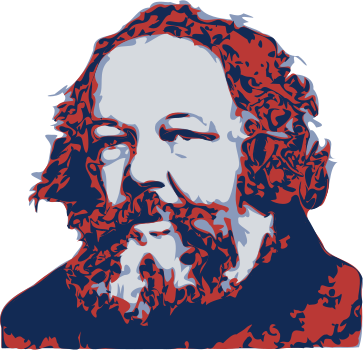
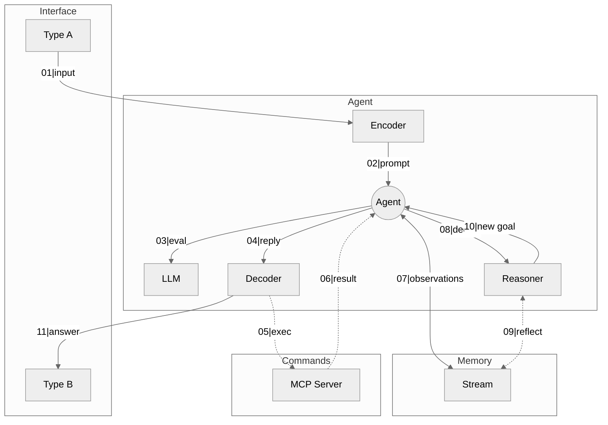

<p align="center">
  
  <h3 align="center">thinker</h3>
  <p align="center"><strong>Typed Determinism for Probabilistic AI</strong></p>

  <p align="center">
    <!-- Version -->
    <a href="https://github.com/kshard/thinker/releases">
      
    </a>
    <!-- Documentation -->
    <a href="https://pkg.go.dev/github.com/kshard/thinker">
      
    </a>
    <!-- Build Status  -->
    <a href="https://github.com/kshard/thinker/actions/">
      
    </a>
    <!-- GitHub -->
    <a href="https://github.com/kshard/thinker">
      
    </a>
    <!-- Coverage -->
    <a href="https://coveralls.io/github/kshard/thinker?branch=main">
      
    </a>
    <!-- Go Card -->
    <a href="https://goreportcard.com/report/github.com/kshard/thinker">
      
    </a>
  </p>
</p>

---

`thinker` is a minimal, strictly typed Go framework that models all AI interactions — from simple prompts to complex autonomous loops — as composable side-effect functions (`ƒ: A ⟼ B`). It equips developers with idiomatic patterns to build robust AI agents, safely bridging Go's strict determinism with the probabilistic behavior of language models.

- [Design](#design)
- [Why Go for AI?](#why-go-for-ai)
  - [1. Deterministic Guardrails for Probabilistic Logic](#1-deterministic-guardrails-for-probabilistic-logic)
  - [2. The Blackboard and concurrency](#2-the-blackboard-and-concurrency)
  - [3. Refactorability of Evolving Schemas](#3-refactorability-of-evolving-schemas)
  - [4. The "Context" of Agency](#4-the-context-of-agency)
  - [5. Deployment as an Artifact, Not an Environment](#5-deployment-as-an-artifact-not-an-environment)
- [Quick start](#quick-start)
- [High-level abstractions (Nanobot)](#high-level-abstractions-nanobot)
  - [ReAct\[A, B\]](#reacta-b)
  - [ThinkReAct\[S, A, B\]](#thinkreacts-a-b)
  - [Reflect\[S, A, B\]](#reflects-a-b)
  - [Seq\[S, A, B\]](#seqs-a-b)
  - [Blackboard pattern](#blackboard-pattern)
- [Commands, Tools and MCP Servers](#commands-tools-and-mcp-servers)
- [Composition](#composition)
- [Contributing](#contributing)
- [License](#license)

## Design

An agent is a side-effect function `ƒ: A ⟼ B`. It accepts a typed input, optionally uses memory, reasoning and external tools, and returns a typed output. This library gives developers an idiomatic toolkit to orchestrate AI agents, anchoring the probabilistic outputs of LLMs within the strict determinism of Go:

1. **Minimal** — ano hidden magic; every component is explicit and replaceable.
2. **Typed** — ainputs and outputs are Go types that are declared by the agent (the library uses generics); the compiler enforces correctness.
3. **Composable** — agents are functions; they can be piped, sequenced, or wrapped freely using Go syntax.
4. **Interoperable** — works with any LLM provider (AWS Bedrock, OpenAI, LM Studio, …) via the [`chatter`](https://github.com/kshard/chatter) adapter, and with any tool via the [Model Context Protocol](https://modelcontextprotocol.io).

The libray consists of three layers:
* **Core abstractions** at the root package `github.com/kshard/thinker` defines types and interfaces every component depends on;
* **Agent toolkit** is ready-to-use types (`agent`, `memory`, `reasoner`, `codec`, `command`) for low-level agent development; 
* **Nanobot** is (`agent/nanobot`) is the high-level declarative api for build-and-compose production quality AI agents. It is recommened to use `agent/nanobot` abstractions and patterns instead of low-level toolkit.


**Inspired by**
- [Generative Agents: Interactive Simulacra of Human Behavior](https://arxiv.org/pdf/2304.03442)
- [REACT : SYNERGIZING REASONING AND ACTING IN LANGUAGE MODELS](https://arxiv.org/pdf/2210.03629)
- [Exploring Advanced LLM Multi-Agent Systems Based on Blackboard Architecture](https://arxiv.org/abs/2507.01701)

## Why Go for AI?

Most people uses Python (LangChain/AutoGPT) for this...

> "We don't use Go because it's fast; we use Go because it's the language that treats **Logic** with the same rigor that an LLM treats **Language**."


### 1. Deterministic Guardrails for Probabilistic Logic

In most AI frameworks, the "glue" between the LLM and the code is as "mushy" as the LLM itself. By modeling agents as $\mathcal{F}: A \to B$, `thinker` uses Go’s type system as a **physical boundary**. You aren't just parsing JSON; you are using the compiler to define the "Phase Space" in which the AI is allowed to operate. If the LLM tries to hallucinate a tool or a field that doesn't exist in your Go struct, the system fails at the type-gate before it can execute an invalid state transition.


### 2. The Blackboard and concurrency

Multi-agent systems are fundamentally a **concurrency and coordination problem**, not a "prompting" problem. Python’s `asyncio` and threading model require explicit care when managing shared state. Go’s channels and `sync` primitives allow multiple agents (Goroutines) to read/write to a shared memory space with native safety. In `thinker`, the "Blackboard" isn't a complex design pattern; it’s just idiomatic Go memory management.


### 3. Refactorability of Evolving Schemas

AI agents are never "finished." You will constantly change your tool definitions, your state structs, and your prompts. In a dynamic language, changing a deeply nested key in your "Agent State" is a runtime gamble. In `thinker`, because of the **lens-based optics** and strict typing, the compiler performs a full "impact analysis" every time you change your model. If you rename a field in your Blackboard, the compiler identifies every agentto be updated. This is "Industrial Grade" AI development.


### 4. The "Context" of Agency

Deep agentic loops often involve long-running I/O, potential infinite loops, and the need for immediate termination. Go’s `context.Context` is the perfect "nervous system" for an agent. It provides a standardized way to propagate cancellations, timeouts, and tracing metadata through a tree of recursive agent calls. Implementing a "Hard Stop" or a "Budget Timeout" across 50 nested LLM calls is a one-liner in Go; in other ecosystems, it requires custom signal-handling logic.


### 5. Deployment as an Artifact, Not an Environment

AI agents are increasingly being moved to the "Edge": sidecars, Lambda functions, or embedded CLI tools. Shipping an agent should not require shipping a 2GB Docker image with 400 `pip` dependencies and a specific C++ toolchain for a vector-math library. A `thinker` agent is a **single, static binary**. This dramatically reduces the "Cold Start" problem for serverless agents and simplifies the security audit of the AI's supply chain.


| Feature          | The Python Problem                                  | The `thinker` (Go) Solution                        |
| :--------------- | :-------------------------------------------------- | :------------------------------------------------- |
| **Tool Safety**  | Runtime "KeyErrors" from LLM hallucinations.        | **Compile-time** enforcement of tool schemas.      |
| **Coordination** | Global Interpreter Lock (GIL) limits agent scaling. | **Goroutines** allow N-agents to scale natively.   |
| **Persistence**  | Complex "State" serializers for Blackboards.        | **Lenses & Optics** for zero-copy state injection. |
| **Execution**    | Heavy, fragile environments.                        | **Single Static Binary** with zero dependencies.   |


## Quick start

**Prerequisites:** Go 1.25+. Access to AWS Bedrock, OpenAI, or LM Studio. See "Setup" section at [doc/USER-GUIDE.md](./doc/USER-GUIDE.md#setup) for configure LLMs access.

```bash
go get github.com/kshard/thinker
```

An agent is just a state machine where the transitions are decided by an LLM. In the example below (a "Hello World" for agent), the agent transitions from **Thinking** (I need to calculate 15% of 120) to **Acting** (running the calc function) to **Observing** (seeing the result is 18) before finally returning the answer.". See [the complete example](./examples/nanobot/01_helloworld/main.go)

```go
package main

import (
	"context"
	"fmt"

	"github.com/kshard/chatter/provider/autoconfig"
	"github.com/kshard/thinker/agent/nanobot"
)

var (
  // Configure access to LLMs
  llm = autoconfig.MustFrom(autoconfig.Instance{
    Name:     "base",
    Provider: "provider:bedrock/foundation/converse",
    Model:    "global.anthropic.claude-sonnet-4-5-20250929-v1:0",
  })

  // Create nanobot runtime.
  env = nanobot.NewRuntime(nil, llm)

  // Create the ReAct agent using the prompt file.
  bot = nanobot.ReAct[float32, string](env,`data:text/markdown,---
server:
  - name: calc
    url: https://mcp.example.com/
---
What is a 15%% tip on a ${{ . }} bill?`,
  )
)

func main() {
  // Use the agent
  val, err := bot.Prompt(context.Background(), 120)
  if err != nil {
    panic(err)
  }

  fmt.Printf("%s\n", val)
}
```

See examples: 
* [examples/nanobot](./examples/nanobot/) for high-level abstractions 
* [examples/toolkit](./examples/toolkit/) for low-level api


## High-level abstractions (Nanobot)

Bots are autonomous loops orchestrated by language models. The inputs and outputs are controlled by deterministic guradrails written in Go. The Markdown controls the language model behaviour, and which MCP servers to connect. The `agent/nanobot` toolkit provides execution environment, bindings and composable bot patterns that cover the most common use-cases. 

The design behind a high-level api is formally defined by [A Kleisli Category Model of AI Agent Behavior](./doc/Kleisli-Cat-AI-Agent-Behavior.pdf)

Markdown document with an optional YAML front-matter block serves as the specification for an agent. 
```markdown
---
name: Classify sentiment          # human-readable label (used in logs)
runs-on: base                     # LLMs key; falls back to "base"
retry: 3                          # max retries on error
debug: false                      # if true, log full LLM dialog to stderr

schema:
  input:                          # Optional JSON Schema for the input
    type: object
    properties:
      text: { type: string }
  reply:                          # JSON Schema for output, mandatory for type-safe output
    type: array
    description: list of sentiments
    items:
      type: string
      description: sentiment classes

servers:                          # MCP servers to connect for this prompt only
  - name: kb
    url: https://kb.example.com/mcp
  - name: calc
    command: [python3, tools/calc.py]
---
Analyse the sentiment of the following text and return a JSON object.

Text: {{.Text}}
```

**Template variables:** the prompt body is a Go `text/template`. The input value `A` is the dot (`.`). If `A` is a struct, use `{{ .FieldName }}` or `{{ .FuncName }}`; if `A` is a string, use `{{ . }}`.


### ReAct[A, B]

The Reason-and-Act (ReAct) pattern implements a cyclical process of **thinking**, **acting**, and **observing**. This loop continues iteratively until the defined goal is achieved.

ReAct serves as the **core building block** for enabling agentic behavior. It provides the fundamental mechanism for decision-making and interaction.

All other patterns are **convenience abstractions** built on top of ReAct, composing and orchestrating ReAct-based agents in various ways to support more complex behaviors. Their primary purpose is to support a **declarative approach** to agent definition. While it is possible to implement the same logic imperatively using only Go and ReAct, doing so typically results in significant boilerplate code.


```mermaid
%%{init: {'theme':'neutral'}}%%
graph TD
    subgraph Interface
    A[Type A]
    B[Type B]
    end
    subgraph Memory
    S[Stream]
    end
    subgraph Commands
    C[MCP Server]
    end
    subgraph Agent
    A --"01|input"--> E[Encoder]
    E --"02|prompt"--> G((Agent))
    G --"03|eval"--> L[LLM]
    G --"04|reply"--> D[Decoder]
    D -."05|exec".-> C
    C -."06|result".-> G
    G <--"07|observations" --> S
    G --"08|deduct"--> R[Reasoner]
    R <-."09|reflect".-> S
    R --"10|new goal"--> G
    D --"11|answer" --> B
    end
```

### ThinkReAct[S, A, B]

Plan-and-Execute pattern implements two phase flow where the agent first plans a sequence of actions based on the current state and then executes those actions, potentially updating the state after each action.

### Reflect[S, A, B]

Reflect implements judge-then-correct loop. A judge bot evaluates the current state. On rejection, a react bot corrects the state, and the review loop retries.

### Seq[S, A, B]

Chains two bots over a shared blackboard state. The intermediate result of the first bot is merged into the blackboard and then second bot returns the final output.

### Blackboard pattern

At first glance, the framework’s type system and composition model may appear to enforce a strict hierarchy, encouraging linear thinking and limiting the ability to address non-linear problems. However, this is not the case.

Applications should introduce a “**blackboard**” — a shared state that enables agents to exchange information freely. This shared context allows for unexpected connections and interactions, often leading to emergent behavior and breakthrough insights. It is a type for shared state:

```golang
type State struct { /* ... */}

var (
  botA = nanobot.ReAct[State, string](/* ... */)
  botB = nanobot.ReAct[State, string](/* ... */)
  botC = nanobot.ReAct[State, string](/* ... */)
)
```

## Commands, Tools and MCP Servers

The library support only [Model-Context-Protocol](https://modelcontextprotocol.io/specification/2025-06-18) using [the official Golang SDK](https://github.com/modelcontextprotocol/go-sdk) over multiple transport protocols (i) in-memory for native Golang integration, (ii) stdio and (iii) http(s), https + oauth 2.0 and https + aws iam.  


## Composition

Beyond the patterns exposed through high-level APIs, the library does not provide built-in mechanisms for chaining or composing agents. Instead, it encourages the use of **idiomatic Go**, such as functional composition and channels, to build flexible and explicit orchestration logic.

## Contributing

The library is [MIT](LICENSE) licensed and accepts contributions via GitHub pull requests:

1. Fork it
2. Create your feature branch (`git checkout -b my-new-feature`)
3. Commit your changes (`git commit -am 'Added some feature'`)
4. Push to the branch (`git push origin my-new-feature`)
5. Create new Pull Request

**Build and test:**

```bash
git clone https://github.com/kshard/thinker
cd thinker
go test ./...
```

Commit messages should answer _what_ changed and _why_, following the [Contributing to a Project](http://git-scm.com/book/ch5-2.html) template from the Git book.

Report bugs via [GitHub issues](https://github.com/kshard/thinker/issues) with a reproducible test case.

## License

[](LICENSE)
